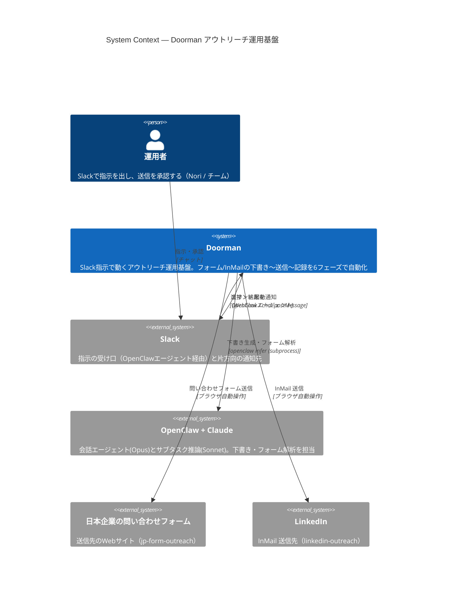
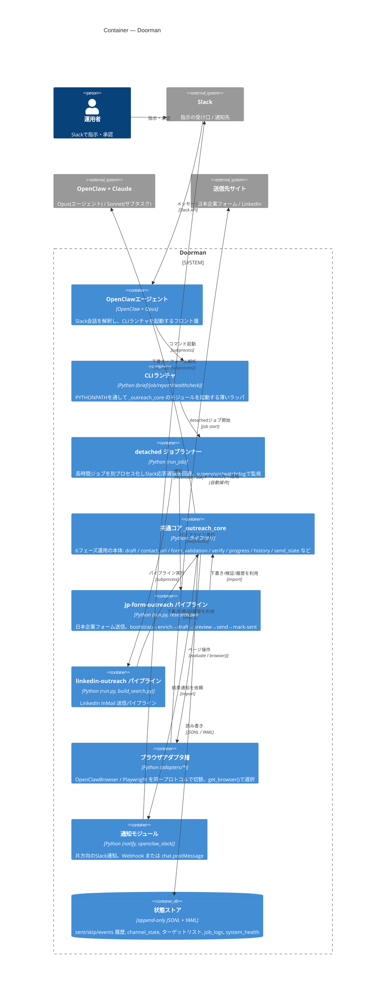

# Doorman — C4アーキテクチャ図（L1 + L2）

ソースコードから抽出した [C4モデル](https://c4model.com/) のレベル1（System Context）とレベル2（Container）。
対象リポジトリ: `openclaw_skills`（共通コア `_outreach_core` + チャンネル別スキル）。

> 抽出元: `README.md`, `_outreach_core/`（infer / notify / adapters / paths ほか）, `jp-form-outreach/run.py`, CLI ランチャ（`brief` / `job` / `report` / `healthcheck`）。

---

## L1 — System Context

「Doorman が誰のために、どの外部システムとやり取りするか」の俯瞰図。内部構造は次の L2 で展開する。

**要点**

- 入力経路は Slack のみ（運用者 → OpenClawエージェント → Doorman）。Doorman 側からも Slack へ片方向通知を返す（`notify.py` / `openclaw_slack.py`）。
- LLM は2系統。会話エージェントは Opus、Python パイプライン内のサブタスク（下書き・フォーム解析）は Sonnet 固定（`infer.py` の `DEFAULT_MODEL`）。
- 送信先は2系統。日本企業の問い合わせフォームと LinkedIn InMail。どちらもブラウザ自動操作で到達する。

---

## L2 — Container

Doorman を「実行単位（コンテナ）」に分解する。`_outreach_core` を軸に、薄い CLI ランチャ、チャンネル別パイプライン、ブラウザ抽象層、append-only な状態ストアで構成される。

**コンテナの責務メモ**

- **OpenClawエージェント** — Slack 会話を解釈する唯一のフロント。Opus 4.7 系（リポジトリ外で設定）。ここから下は決定論的な Python に渡る。
- **CLIランチャ** (`brief` / `job` / `report` / `healthcheck`) — どのディレクトリからでも `PYTHONPATH=.` を通して `_outreach_core.helpers.*` を `runpy` で起動するだけの薄い層。
- **detached ジョブランナー** (`run_job`) — 長時間ジョブを別プロセス化し、Slack の応答遅延を回避。`run_supervisor` / `watchdog` / `heartbeat_watch` が死活監視する。
- **共通コア `_outreach_core`** — 本体。下書き(`draft`)とフォーム解析だけが LLM を使い、`verify` / `progress` / `history` / `report` は原則 LLM なしの純関数。今回修正した `contact_url`（フォーム種別判定）もここ。
- **チャンネル別パイプライン** — `jp-form-outreach` と `linkedin-outreach`。同じ契約（コアの import）で、実行面（フォーム送信 / InMail）だけ差し替える。
- **ブラウザアダプタ層** (`adapters/`) — `BrowserAdapter` プロトコルの背後で OpenClawBrowser と Playwright を切替。呼び出し側は `get_browser()` だけを見る（具体アダプタを import しない）。
- **状態ストア** — `sent_history.jsonl` / `skip_history.jsonl` / `events.jsonl` を中心に append-only。再実行の冪等性と再開容易性を確保。ターゲットリスト(YAML)・`channel_state`・`job_logs`・`system_health` もここ。

---

## 設計上の不変条件（コードから読み取れる方針）

1. **決定論と LLM の分離** — LLM は `draft` と form analyzer に限定し、失敗時は純関数で補正する。
2. **append-only 履歴** — 状態は追記中心。再開・冪等性を最優先。
3. **安全優先 submit** — 生 `form.submit()` を避け `requestSubmit` ベース。
4. **アダプタ seam** — ブラウザバックエンド（OpenClaw / Playwright）は差し替え可能で、ロールバック先が常に存在する。
